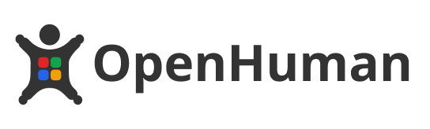
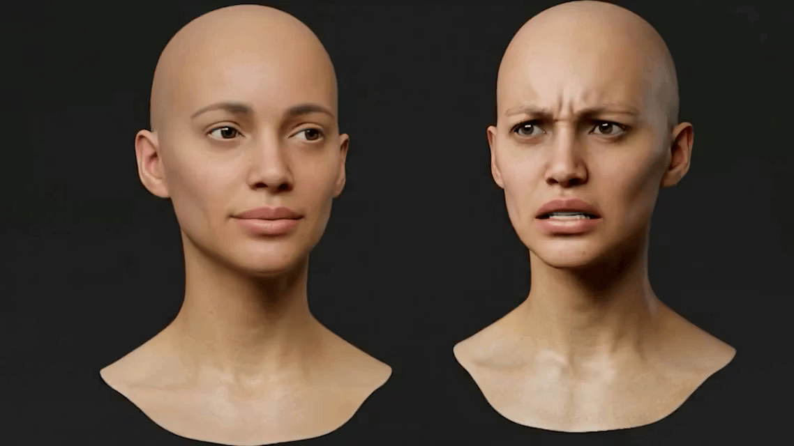

# OpenHuman - Open store for digital human

OpenHuman AI - Open store for digital human OpenHuman is an open platform for digital humans and conversational AI interfaces designed to make artificial intelligence accessible through natural human interaction. OpenHuman Research Lab founded as an independent research initiative beginning in 2023, OpenHuman focuses on building lifelike AI characters that communicate through facial expression, voice, gesture, and language, enabling people to interact with AI as naturally as speaking to another person. The platform combines real-time 3D rendering, conversational AI, animation systems, speech processing, and facial expression technology into a unified runtime for creating interactive digital human.

Developers: https://developer.openhuman.ai

Main website: https://openhuman.ai

Ours official channels:

- GitHub: https://github.com/openhuman-ai
- LinkedIn: https://linkedin.com/company/openhuman
- X/Twitter: https://x.com/openhuman
- Facebook: https://www.facebook.com/OpenHumanAI
- Telegram: https://t.me/openhuman_official
- Tiktok: https://www.tiktok.com/@openhuman_ai
- Instagram: https://www.instagram.com/openhuman_ai/
- Threads: https://www.threads.com/@openhuman_ai
- Product Hunt: https://www.producthunt.com/products/openhuman-ai
- Discord: https://discord.gg/q7rNGqXKfS
- Email: contact@openhuman.ai

